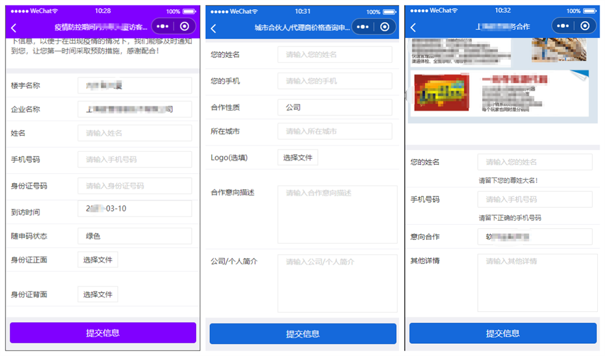
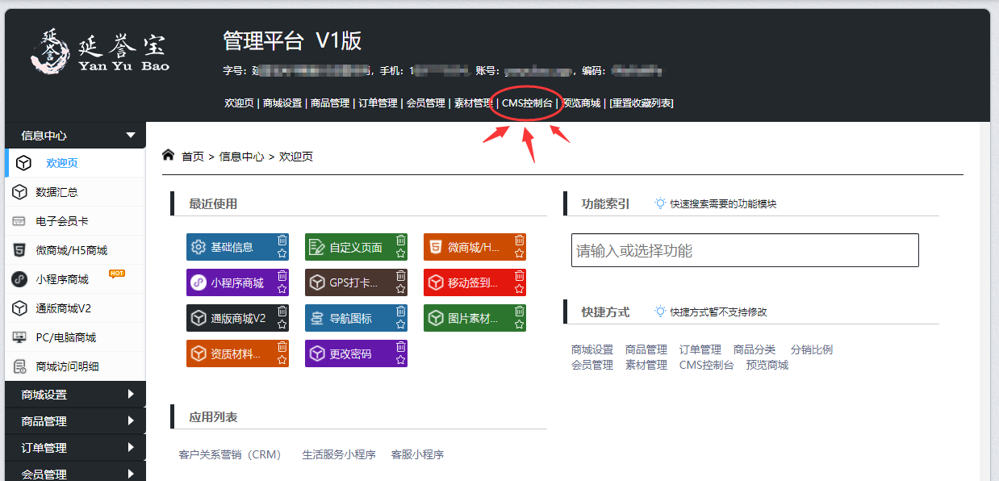
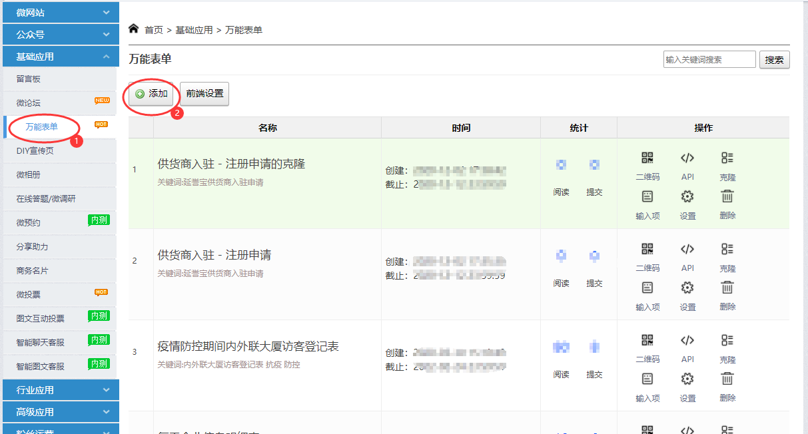

# 万能表单插件使用说明

万能表单和问卷调查的微信小程序插件，快速制作在线表单收集信息，是万能表单、问卷调查、自定义表单、信息收集表、数据采集表的功能软件。

最新的插件版本，除了支持自定义表单之外，还支持自定义页面，将传统H5网页自动转为图文并茂的小程序原生页面。

项目最新的更新信息和使用说明见：

[https://github.com/longmix/wxa-plugin-wannengbiaodan](https://github.com/longmix/wxa-plugin-wannengbiaodan)


#### 在内容中使用超链接和复制文本

语法结构都为：

```
<a href="xxxxxx">点击这里</a>
```

其中的href对应的语法是如下：

* 使用超级链接： https://
* 复制文本到剪贴板：  copytext://


### 自定义页面功能模块

调用自定义页面请移步：

*[https://github.com/longmix/wxa-plugin-wannengbiaodan/blob/main/welcome_page_readme.md](https://github.com/longmix/wxa-plugin-wannengbiaodan/blob/main/welcome_page_readme.md)*


>**以下是万能表单的功能调用**


## 【调用方法1】通过Page跳转调用的方法

### 在app.json中引入插件


```javascript
"plugins": {
    "yyb_selfform_plugin": {
        "version": "1.1.0",
        "provider": "wx00d1e2843c3b3f77" 
    }
  }
```

其中的版本号可能会有所变化。如果是通过第三方服务商开发小程序，可以放在ext.json中。


在具体的页面的js文件中加入以下代码：

```javascript
var params_str = 'sellerid=pmyxQxkkU&token=abcdefg&formid=1234';

      wx.navigateTo({
        url: 'plugin-private://wx00d1e2843c3b3f77/pages/selfform?'+ params_str  
      })
```

或者

```javascript
var params_str = 'sellerid=pmyxQxkkU&token=abcdefg&formid=1234';

      wx.navigateTo({
        url: 'plugin://yyb_selfform_plugin/pages/selfform?'+ params_str  
      })
```

** 注意：url的路径这两种写法，都是小程序插件的标准。


参数举例如下，关于参数的说明，见下文。

| No. | 参数举例 | 参数说明 |
| :-----:| :----: | :----: | :---- |
| 1 | sellerid=pQNNmSkaq&form_type=1&userid=1234&checkstr=aaaaaaaaaa | 请求商户pQNNmSkaq的会员ID为1234的会员的属性 |
| 2 | sellerid=pmyxQxkkU&form_type=2&form_token=gwcuuk1411034699&formid=37 | 填写CMS系统中ID为37的万能表单 |
| 3 | 参数太长，见“备注001” | 填写CMS系统中ID为342的万能表单，以及其他操作。 |
| 4 | sellerid=pmyxQxkkU&form_type=3&form_token=cugnmr1590638215&formid=4493 | 为CMS系统中ID为4493的分类增加一篇文章 |
| 5 | sellerid=pQNNmSkaq&scene=302@0@pic | 获取商城系统中的ID为302的广告图片 |

>备注001： sellerid=pmyxQxkkU&form_type=2&form_token=mrfuhd1546833814&formid=342&submit_url=https%3A%2F%2Fyanyubao.tseo.cn%2Fopenapi%2FJianghanyinhua%2Fsubmit_data_notify_type&openid=oTESv4sCTCIMncMYUisOKRgNBTFg
（填写CMS系统中ID为342的万能表单，并将数据保存到指定的网址submit_url，同时，如果openid:oTESv4sCTCIMncMYUisOKRgNBTFg）


### 如何在富媒体中增加链接？
在你的小程序项目的app.json中添加以下配置：


```bash
"plugins": {
    "yyb_selfform_plugin": {
      "version": "1.2.7",
      "provider": "wx00d1e2843c3b3f77",
      "export": "exportToPlugin.js"
    }
  }
```

* 特别注意：增加了“"export": "exportToPlugin.js"”，该文件的代码具体见：
  *[https://github.com/longmix/wxa-plugin-wannengbiaodan/blob/main/miniprogram/exportToPlugin.js](https://github.com/longmix/wxa-plugin-wannengbiaodan/blob/main/miniprogram/exportToPlugin.js)*
* exportToPlugin.js中的函数名称“`link_item_click`”不可以修改，必须使用这个名字。
* 因为在插件中没有权限调用wx.NavagteTo接口，所以link_item_click这个函数里面同样不可以通过这个接口跳转到其他界面或者H5页面；但是可以使用复制到剪切板等其他接口。
* 如果希望这个点击事件可以跳转出去，需要通过【调用方法2】实现。


其中的“"export": "exportToPlugin.js"”指定为可以供插件调用的外部响应函数，分别处理链接点击和复制到剪贴板，
完整的代码在  /miniprogram/exportToPlugin.js。
示例代码如下：
```
module.exports = {
  link_item_click: function(url){

    console.log('bottom_icon_click===>>>', url);

		console.log('被点击的网址：' + url);

    //因为不能跳转网页，所以这里只能复制到剪切板
    wx.setClipboardData({
      data: text,
    });

    wx.showToast({
      title: '网址已复制',
    })


  },
  copy_text:function(text){
    console.log('copy_text===>>>', text);
		//console.log('bottom_icon_click===>>>', url);

    console.log('准备复制的内容：' + text);
    
    wx.setClipboardData({
      data: text,
    })


  },

}

```


## 【调用方法2】通过组件调用的方法

> 如果不想做深入集成，通过方法1完全够用，此方法可以无视。为了让本文档简介， 具体集成方法见：
>[https://github.com/longmix/wxa-plugin-wannengbiaodan](https://github.com/longmix/wxa-plugin-wannengbiaodan)


## 万能表单的参数说明

| No. | 参数名称 | 必填 | 参数说明 |
| :-----:| :----: | :----: | :---- |
| 1 | sellerid | 是 | 延誉宝商户编号，用于动态获取头部和按钮的背景颜色。 |
| 2 | form_token | 否 |  微读客项目Token，可选，用于验证formid是否合法。 |
| 3 | formid | 是 |  万能表单ID，用于显示表单的内容 |
| 4 | form_type | 否 |  表单类型，默认为2，代表读取微读客的万能表单 |
| 5 | submit_url | 否 |  数据提交的网址入口，URL的域名必须在小程序的request域名列表中，具体见下面说明。 |
| 6 | 其他参数 | 否 |  在进入小程序页面时候带进去，并随着其他字段一起提交到网址。  |
| 7 | scene | 否 |  小程序中的场景ID，可以生产无限多个小程序码。  |
| 8 | openid | 否 |  如果form_type等于2，则可以带上openid，以获取之前填写的数据。  |
| 9 | userid | 否 |  如果form_type等于1，则userid参数必带，请做好身份验证。  |


### 关于submit_url说明

submit_url: 数据提交的网址入口，URL的域名必须在小程序的request域名列表中。 
数据以post方式提交，格式为 aaa=1234&bbb=5678。 
建议拦截数据并保存的同时，通过这个API接口提交给CMS存储一份副本。 
submit_url必须返回的格式为 {'code':1, 'msg':'success'}，其中code为1代表保存成功。 


### 关于“其他参数”说明

在进入小程序页面时候带进去，并随着其他字段一起提交到网址。 
举例说明：form_type=2&form_token=abcdefg&formid=1234&orderno=87654321，那么“orderno”就是其他参数，保存数据的时候，会被一起提交到服务器。

### 关于scene参数的说明

在微信小程序中：以上设置支持scene参数模式（scene：小程序中的场景ID），可以生产无限多个小程序码。
格式为：sellerid#formtype#form_token#formid，例如“pmyxQxkkU2#abcd#1234”
代表 :
sellerid等于pmyxQxkkU，form_type等于 2，form_token为abcdef，formid为1234。

如果form_type为3，参考为2的情况（小程序端暂不支持为3的场景）； 
如果为1，则后面两个参数随便填写，但是必须填写。 

其他小程序和APP：暂不支持scene参数自动生成小程序码或者二维码。


### 效果预览




## 设置万能表单

在延誉宝后台设置万能表单，操作路径为：延誉宝SaaS云 &gt;&gt; CMS控制台 &gt;&gt; 万能表单

操作界面截图如下：




后台提供强大的自定义表单字段的功能，同时对于收集到的表单信息，及时通过微信模板消息和电子邮件通知，以便及时查看和处理。


## 常见问题

常见问题不在这里单独更新，具体访问github主页。


-------------------华丽的分割线-------------------

# 自定义页面的功能调用

>**以下是自定义页面的功能调用，自定义页面是这个小程序插件集成的另一个功能模块。**


## 【调用方法1】通过Page跳转调用的方法

### 在app.json中引入插件

```javascript
"plugins": {
    "yyb_selfform_plugin": {
        "version": "1.2.3",
        "provider": "wx00d1e2843c3b3f77" 
    }
  }
```

其中的版本号可能会有所变化。如果是通过第三方服务商开发小程序，可以在ext.json中。


### 在具体的页面的js文件中编写以下代码

```javascript

      var params_str = 'sellerid=pQNNmSkaq&platform=cms&imgid=7967';

      wx.navigateTo({
        url: 'plugin-private://wx00d1e2843c3b3f77/pages/welcome_page?'+ params_str      
      })
```
参数举例如下，关于参数的说明，见下文。

| No. | 参数举例 | 参数说明 |
| :-----:| :----: | :----: | :---- |
| 1 | sellerid=pQNNmSkaq&platform=cms&imgid=7967 | 获取CMS系统中的文章ID为7967的富媒体内容 |
| 2 | sellerid=pQNNmSkaq&platform=pic&imgid=302 | 获取商城系统中的ID为302的广告图片 |
| 3 | 参数太长，见“备注002” | 通过网址获取自定义页面的内容，并设置推荐人ID为1234。 |
| 4 | sellerid=pQNNmSkaq&scene=7967@0@cms | 获取CMS系统中的文章ID为7967的富媒体内容 |
| 5 | sellerid=pQNNmSkaq&scene=302@0@pic | 获取商城系统中的ID为302的广告图片 |

>备注002： sellerid=pQNNmSkaq&parentid=1234&data_url=https%3A%2F%2Fyanyubao.tseo.cn%2Fopenapi%2FJianghanyinhua%2Fget_order_scan_report_page%3Forderno%3D20170123172139NJVOPW%26messageid%3D2968

### 常见问题

#### 如何跳转自定义页面中的链接？
在你的小程序项目的app.json中添加以下配置：
```
	"plugins": {
		"yyb_selfform_plugin": {
			"version": "dev",
			"provider": "wx00d1e2843c3b3f77",
			"export": "exportToPlugin.js"
		}
	},
```
具体的参考万能表单部分的《底部导航中的跳转链接》。


### 底部导航菜单

#### 底部导航菜单的自定义

自定义底部导航菜单，可以在延誉宝SaaS云控制台实现，操作路径为：

SaaS云后台>>功能与扩展>>自定义页面>>底部导航


#### 底部导航中的跳转链接


* 如果底部导航中有拨打电话的功能的，则使用默认的即可。
* 如果底部导航中需要跳转到其他页面，请在引用插件的时候，声明export，


## 【调用方法2】通过组件调用的方法

> 同万能表单，如果不想做深入集成，通过方法1完全够用，此方法可以无视。为了让本文档简介， 具体集成方法见：
>[https://github.com/longmix/wxa-plugin-wannengbiaodan](https://github.com/longmix/wxa-plugin-wannengbiaodan)


## 参数说明

| No. | 参数名 | 必填 | 参数说明 |
| :-----:| :----: | :----: | :---- |
| 1 | sellerid | 是 | 延誉宝商户编号，用于动态获取头部和按钮的背景颜色。 |
| 2 | platform | 是 |  内容所属的平台，支持cms和pic |
| 3 | imgid | 是 |  延誉宝CMS平台的文章ID，或者商城广告图片的ID |
| 4 | parentid | 否 |  推荐人ID，可以为0，目前只有定义data_url的时候，可以在处理逻辑值扩展 |
| 5 | data_url | 否 |  获取数据来源的网址，如果定义了此参数，则从这个获取媒体内容。 |
| 6 | scene | 否 |  小程序中的场景ID，可以生产无限多个小程序码。  |


